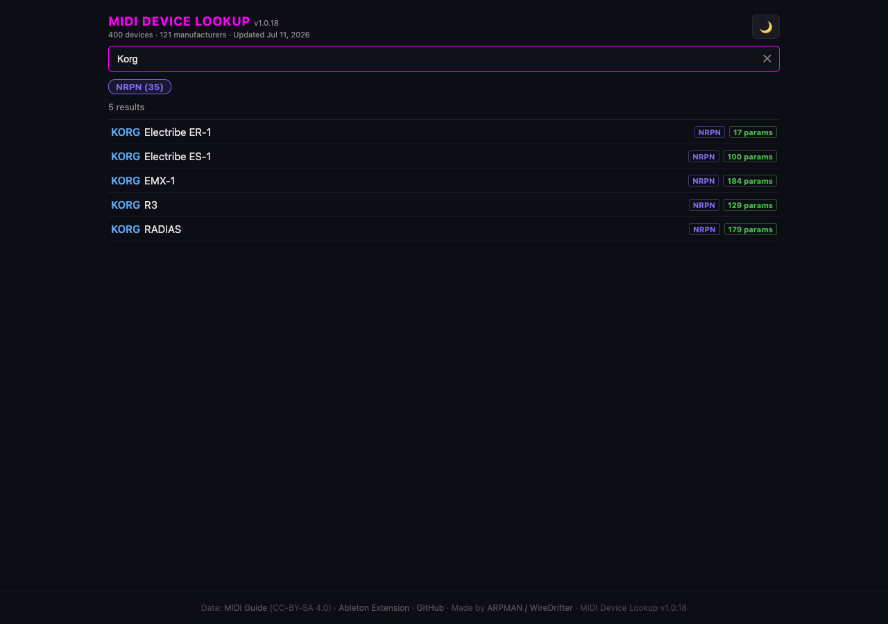
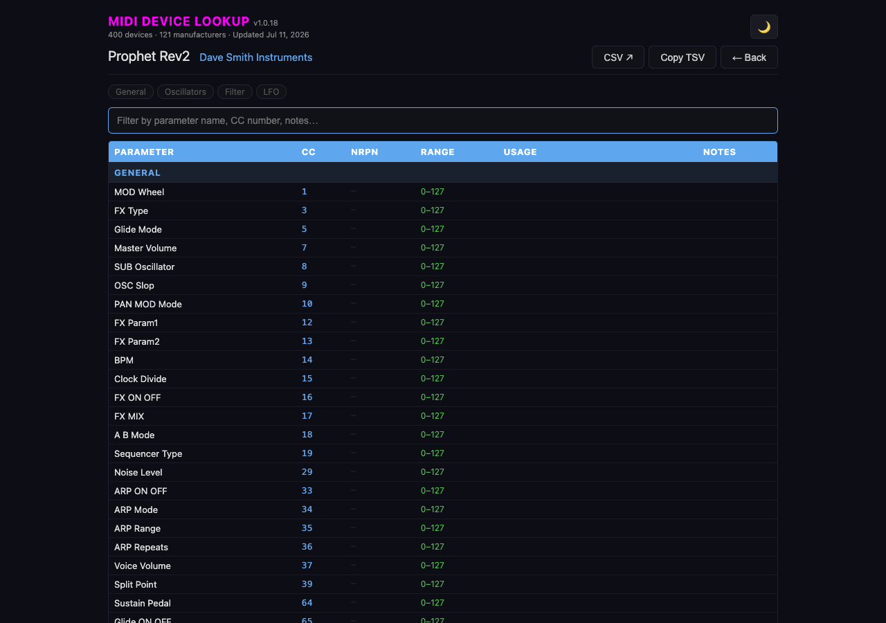

# MIDI Device Lookup

Browse CC and NRPN parameters for 400+ hardware MIDI devices — directly in your browser, no installation needed.

🔗 **[jdaehler.github.io/midi-device-lookup](https://jdaehler.github.io/midi-device-lookup/)**




---

## What it does

- Search across 400+ hardware devices from 121 manufacturers
- Browse CC and NRPN parameters with min/max ranges, descriptions, and sections
- Filter by NRPN — stacks with search (e.g. NRPN active + "Korg" = Korg devices with NRPN)
- Filter within a device's parameter list by section chips or keyword
- Click any parameter row to copy its CC or NRPN number to the clipboard
- Export parameters as CSV or JSON — download for any device
- Copy TSV button exports the full (or filtered) parameter list — paste into Excel or Numbers
- Favorites — star any device, filter to favorites with the ★ chip (stored in browser)
- Search history saved in your browser (last 8 searches)

## Data

Device data comes from [pencilresearch/midi](https://github.com/pencilresearch/midi) (CC-BY-SA 4.0).  
The site is rebuilt automatically every Monday to pick up new devices and corrections.

## Ableton Live Extension

If you use Ableton Live, the same lookup is available as a right-click context menu extension — no browser needed.

🔗 [MIDI Device Lookup for Ableton](https://github.com/jdaehler/abletonliveextensions/releases/tag/midi-device-lookup) · part of the [ARPMAN Extensions](https://github.com/jdaehler/abletonliveextensions)

---

## How it's built

The site is a single `index.html` file — no framework, no dependencies, no server.

```
scripts/
  fetch-and-build.mjs   Fetches all CSVs from pencilresearch/midi, builds index.html
src/
  template.html         UI template — device data injected at build time
.github/workflows/
  weekly-build.yml      GitHub Action: runs every Monday, commits updated index.html
```

### Build locally

```bash
node scripts/fetch-and-build.mjs
```

Requires Node.js 18+. Fetches ~400 CSV files from GitHub and writes `index.html` (~2.2 MB).

---

## What's New

**v1.0.23**
- Search history chips: click × to remove individual entries

**v1.0.22**
- Favorites — star any device to save it; ★ chip filters to favorites only (localStorage)
- Fix: X button now visible when selecting a search history chip
- Fix: result rows right-aligned with fixed column widths (NRPN badge, params count, star)

**v1.0.19**
- Export parameters as CSV or JSON — download button in device detail view
- Multi-device export coming in a future update

**v1.0.18**
- NRPN filter chip — additive, stacks with search, persists while typing
- Web version launched

**v1.0.17 and earlier**
- Light / dark mode toggle, search history, section chips, copy TSV

---

Made by [ARPMAN / WireDrifter](https://youtube.com/@WireDrifter)
